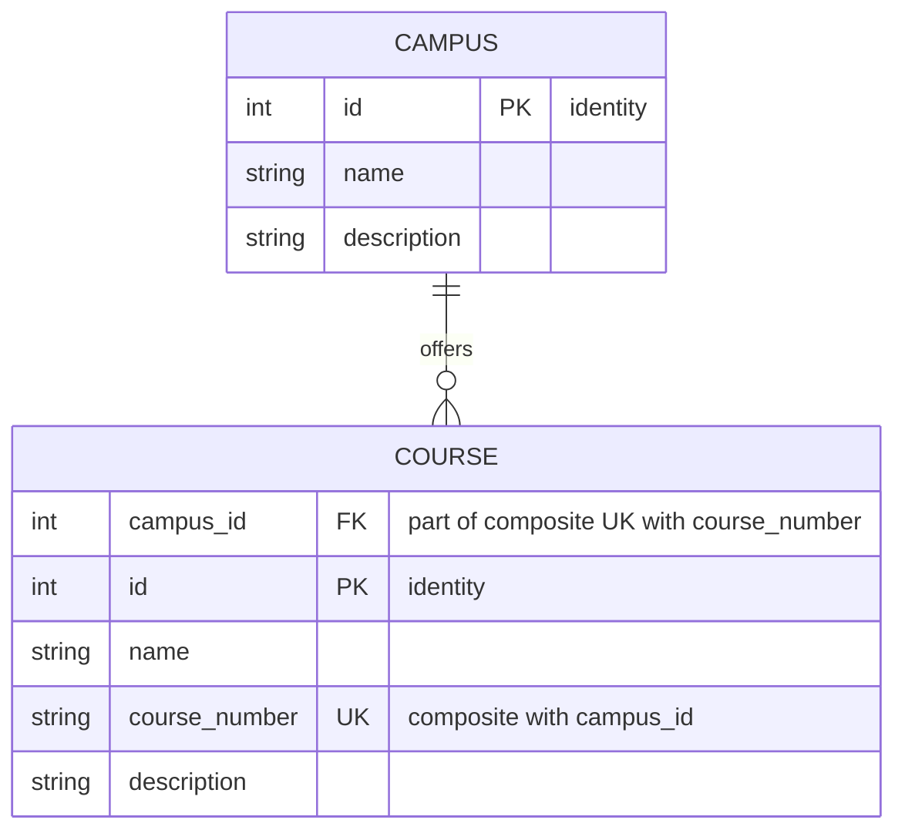

# Entity-Relationship Diagram

Rendered with [Mermaid](https://mermaid.js.org/), which GitHub renders natively inside Markdown — no extra tooling needed to view it.

`PK` marks primary-key columns, `FK` marks a foreign key, `UK` marks a unique constraint, and the quoted note (Mermaid supports an optional comment per attribute) adds detail — `"identity"` flags a database-generated `IDENTITY` column, and the notes on `campus_id`/`course_number` call out that their `UK` is a single *composite* constraint spanning both columns, not two independent ones. Both `CAMPUS.id` and `COURSE.id` are single-column identity primary keys, unique across the whole system — `COURSE.campus_id` is a plain foreign key, not part of the primary key. `course_number` is a human-readable code that only needs to be unique *within* a campus (`UNIQUE (campus_id, course_number)`), so the same code can be reused at a different campus.

## Why an ER diagram instead of a UML class diagram

Mermaid supports both `classDiagram` (UML class notation — attributes, methods, associations) and `erDiagram` (entity-relationship notation — tables, keys, cardinality). `erDiagram` was used here because it maps directly onto relational concepts like composite primary keys and foreign keys, which is what this model actually is. If a later component models these entities as application-level classes (an ORM layer, a domain model in C# or Python), a `classDiagram` view showing that object model would be a reasonable and complementary addition at that point — the two notations answer different questions.
