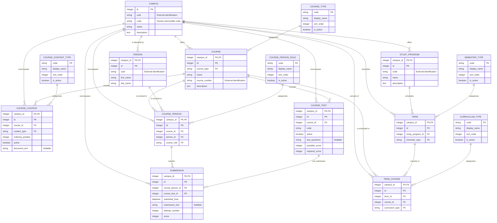

# Entity-Relationship Diagram

Auto-generated by scripts/generate-diagram/generate_diagram.py. Do not edit by hand.
- Source: els-data-model/model/entities/*.json
- Regenerate with: python generate_diagram.py

Rendered with [Mermaid](https://mermaid.js.org/), which GitHub renders natively inside Markdown — no extra tooling needed to view it.

## Why an ER diagram instead of a UML class diagram

Mermaid supports both `classDiagram` (UML class notation — attributes, methods, associations) and `erDiagram` (entity-relationship notation — tables, keys, cardinality). `erDiagram` was used here because it maps directly onto relational concepts like composite primary keys and foreign keys, which is what this model actually is. If a later component models these entities as application-level classes (an ORM layer, a domain model in C# or Python), a `classDiagram` view showing that object model would be a reasonable and complementary addition at that point — the two notations answer different questions.
